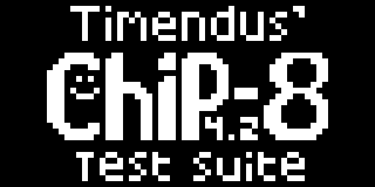
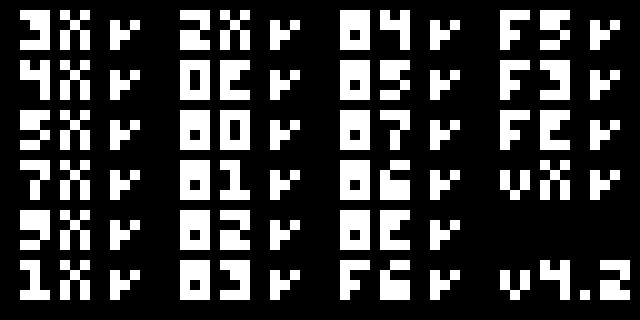
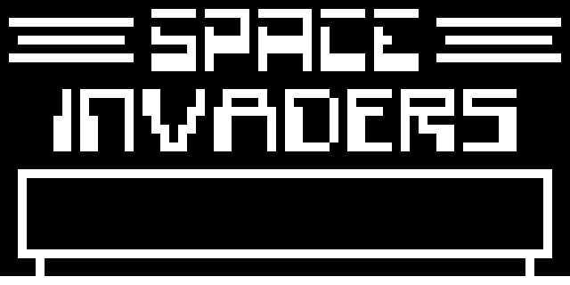

# CHIP-8 Emulator

A CHIP-8 emulator written in C99 with SDL2. A learning project: the
machine logic lives in `src/chip8.c` and does not depend on SDL, so the
core can be tested headless.



## Features

- Full CHIP-8 instruction set (34 opcodes), built warning-free with
  `-std=c99 -Wall -Wextra -pedantic`
- The five original COSMAC VIP quirks, switchable at runtime
- 440 Hz square-wave audio while a ROM's sound timer runs
- Hex keypad mapped positionally over a QWERTY keyboard
- Headless test harness that verifies the core against the
  [Timendus chip-8-test-suite](https://github.com/Timendus/chip8-test-suite)
- An original bundled mini-game, `games/catch.ch8`, assembled from
  `games/catch.asm` and covered by the test harness




## Requirements

- gcc (with C99 support)
- make
- SDL2 (`sudo apt install libsdl2-dev` on Ubuntu/Debian)

## Build

```sh
make
```

To clean objects and the binary:

```sh
make clean
```

## Run

```sh
./chip8 <rom_path> [--cycles N] [--scale N] [quirk flags]
```

| Option        | Description                                               | Default |
|---------------|-----------------------------------------------------------|---------|
| `--cycles N`  | Instructions executed per frame (N × 60 = CPU Hz)         | 10 (~600 Hz) |
| `--scale N`   | Window pixels per CHIP-8 pixel                            | 10 (640×320 window) |

Example:

```sh
./chip8 roms/IBM_Logo.ch8 --cycles 10 --scale 12
```

### Quirk flags

Modern interpreters disagree with the original COSMAC VIP on five
ambiguous behaviors. The defaults follow the original machine; flip them
with:

| Flag            | Effect when set                          |
|-----------------|------------------------------------------|
| `--no-vblank`   | Sprites do not wait for vertical blanking |
| `--no-mem-inc`  | `FX55`/`FX65` leave `I` unchanged         |
| `--no-logic-vf` | OR/AND/XOR do not reset `VF`              |
| `--no-shift-vy` | `8XY6`/`8XYE` shift `VX` in place         |
| `--jump-vx`     | `BNNN` jumps to `NNN+VX` instead of `NNN+V0` |

## Key mapping

The CHIP-8 hex keypad on a standard QWERTY keyboard:

```
CHIP-8:   1 2 3 C        Keyboard:  1 2 3 4
          4 5 6 D                  Q W E R
          7 8 9 E                  A S D F
          A 0 B F                  Z X C V
```

`ESC` (or closing the window) exits the emulator.

## Bundled game: CATCH

An original mini-game included as a working example:

```sh
python3 games/assemble.py   # rebuilds games/catch.ch8 from the source
./chip8 games/catch.ch8
```


A ball falls from the top; move the paddle under it with `A`/`D`
(CHIP-8 keys 7/9). A catch beeps and adds a point (score at the top
right); a miss beeps longer. Endless. `tests/test_catch.c` plays the
game headless: catch, miss, paddle movement and score rendering.

## Getting ROMs

No third-party ROMs are included (see `roms/README.md`). Good sources:

- [CHIP-8 Archive](https://johnearnest.github.io/chip8Archive/) — CC0,
  with previews and control notes for each program
- [Public domain pack](https://archive.org/details/Chip-8RomsThatAreInThePublicDomain)

SCHIP ROMs (`8-scrolling` etc.) will not work: this emulator targets
plain CHIP-8.

## Tests

The core is verified headless against the Timendus chip-8-test-suite
(logo rendering, arithmetic flags, quirks, keypad, sound timing):

```sh
git clone https://github.com/Timendus/chip8-test-suite
SUITE_BIN=chip8-test-suite/bin tests/run_tests.sh
```

`run_tests.sh` builds its own harness, runs every test ROM, checks the
rendered framebuffers for the suite's ok/err markers, plays the bundled
CATCH game end-to-end (`tests/test_catch.c`), and fails on any
unexpected stderr output.
